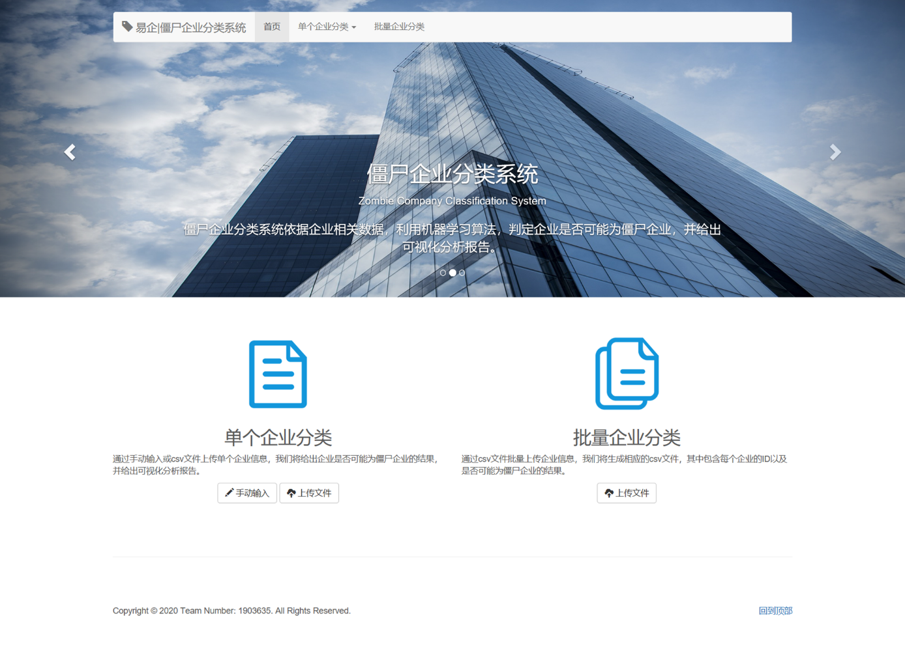
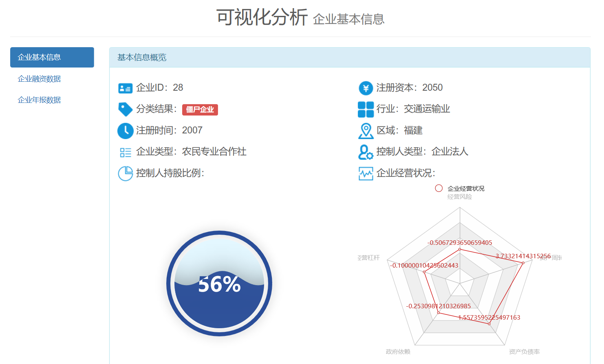
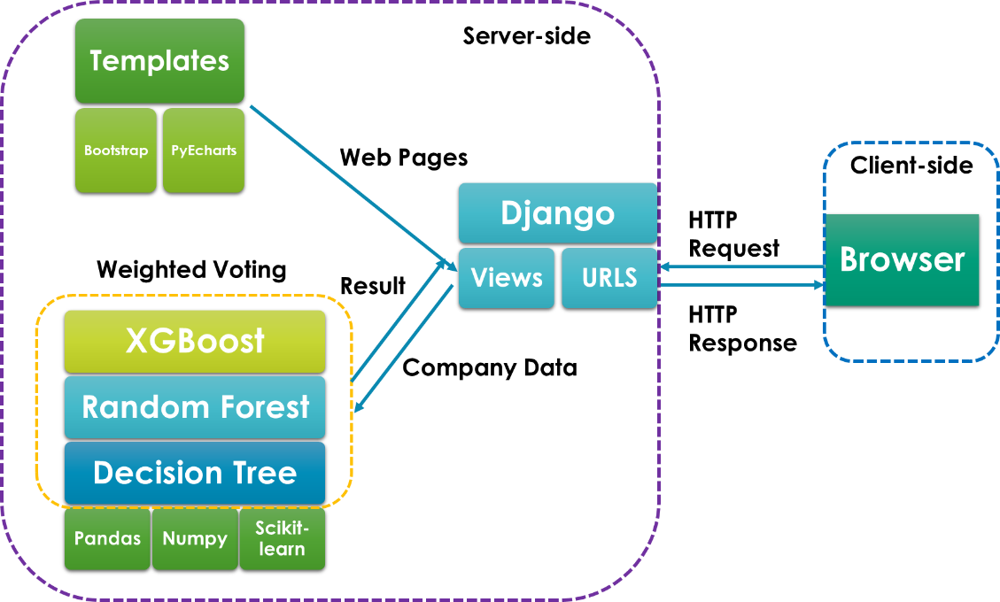

# 易企|僵尸企业分类系统


本项目是2020年第十一届中国大学生服务外包创新创业大赛A09赛题——僵尸企业画像及分类我们团队提交作品的源码。该项目主要任务是要根据给定的企业信息，进行二分类，判断是僵尸企业和非僵尸企业。

本项目分为两部分，第一部分是机器学习训练模型，业务与统计两个角度构造特征，使用RFECV作特征筛选，算法主要使用决策树、随机森林与XGBoost，网格搜索五折交叉参数调优，并使用VotingClassifier做了融合，权重使用遗传算法确定，并做了数据融合。第二部分是Web可视化界面，用于支持单个和批量企业信息的输入与结果输出，以及企业信息可视化，主要使用了Bootstrap、Django与PyEcharts。




## 目录
- [易企|僵尸企业分类系统](#易企僵尸企业分类系统)
  - [目录](#目录)
  - [安装](#安装)
    - [赛题数据](#赛题数据)
    - [依赖](#依赖)
  - [使用](#使用)
    - [机器学习部分](#机器学习部分)
    - [Web端](#web端)
  - [项目整体结构](#项目整体结构)
  - [参考](#参考)
  - [License](#license)

## 安装
### 赛题数据
[下载](http://www.fwwb.org.cn/attached/file/20200103/20200103095031_187.rar)

### 依赖
- Python >= 3.7
- Pandas >= 1.0.0
- Numpy >= 1.17.0
- joblib >= 0.14.1
- Scikit-learn >= 0.22.1
- matplotlib >= 3.1.2
- xgboost >= 1.0.2
- Django >= 3.0.4
- PyEcharts >= 1.7.1

## 使用
### 机器学习部分
data_merge.ipynb是将企业提供的训练集和验证集合并以重新划分，data_process.ipynb是数据预处理与特征工程，data_train.ipynb包含了网格搜索参数调优与多模型加权投票融合，遗传算法确定权重，data_iter.ipynb是数据融合，CompanyClassifier.ipynb包含了最终封装好的企业分类模型。详细内容请参考项目技术文档。

### Web端
进入webclassifier目录下，命令行运行：
```shell
python manage.py runserver
```
访问localhost:8000即可。

## 项目整体结构


## 参考
- 2020年第十一届中国大学生服务外包创新创业大赛：http://www.fwwb.org.cn/news/show/278
- 邹蕴涵. 我国僵尸企业的判别, 影响及对策建议[J]. 中国物价, 2016 (7): 80-82.
- 李霄阳, 瞿强. 中国僵尸企业: 识别与分类[J]. 国际金融研究, 2017, 364(8): 3-13.
- 黄少卿, 陈彦. 中国僵尸企业的分布特征与分类处置[J]. 中国工业经济, 2017, 3: 24-43.
- 周琎, 冼国明, 明秀南. 僵尸企业的识别与预警—来自中国上市公司的证据[J]. 财经研究, 2018, 44(4): 130-142.
- 栾甫贵, 刘梅. 僵尸企业僵尸指数的构建及应用研究[J]. 经济与管理研究, 2018 (6): 12.

## License
[GPL](https://github.com/Bil369/YiQi-ZombieCompanyClassifier/blob/master/LICENSE) &copy; [Bil369](https://github.com/Bil369)
